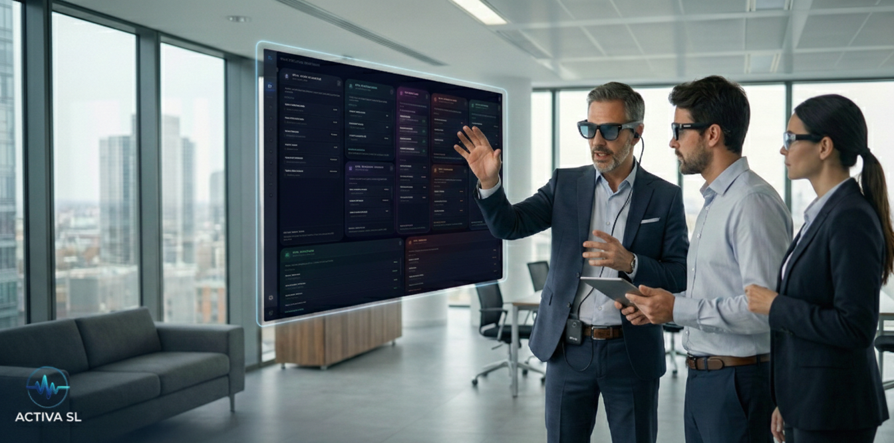

<div align="center">



# ⚡ ACTIVA S.L. DIGITAL

### FUERZA DE INGENIERÍA DE ÉLITE & BÚNKER DE INTELIGENCIA ARTIFICIAL

[](https://activa-sl-digital.web.app)
[](https://cloud.google.com)
[](./docs/SECURITY.md)
[](./docs/AI_ARCHITECTURE.md)

**[🌐 Sede Digital](https://activa-sl-digital.web.app)** • **[🛡️ Command Center](https://activa-sl-digital.web.app)** • **[📄 Manifiesto Técnico](./docs)**

</div>

---

## 🏴‍☠️ SOBRE NOSOTROS

**ACTIVA S.L. DIGITAL** no es una consultora convencional. Somos una **Fuerza de Ingeniería de Élite**.

Nacimos en el sector clínico más exigente (Neurorehabilitación) y evolucionamos para convertirnos en arquitectos de **Sistemas Operativos Empresariales (Titanium OS)**. No vendemos "webs" ni "apps". Construimos **Soberanía Digital**.

Nuestra misión es liberar a las empresas de la dependencia tecnológica mediante la creación de software propietario, autónomo y potenciado por **Inteligencia Artificial Real (A2A - Agent to Agent)**.

> *"No alquilamos tecnología. Forjamos el código que te hace dueño de tu destino."*

---

## 💎 CAPACIDADES ESTRATÉGICAS

### 1. PROPIEDAD INTELECTUAL ABSOLUTA
El activo más valioso de una empresa es su lógica de negocio.
*   **Código Fuente Propietario:** Entregamos repositorios completos, no licencias de uso.
*   **Control Total:** Sin "vendor lock-in". Tú eres el dueño de la infraestructura.

### 2. ARQUITECTURA "TITANIUM" (Google Cloud Native)
Infraestructura diseñada para resistir ataques y escalar globalmente.
*   **Zero-Trust Security:** Lógica serverless blindada.
*   **Datos en Tiempo Real:** Firestore Database con replicación multi-región.
*   **Rendimiento Extremo:** React 18 + Vite para interfaces de <100ms.

### 3. INTELIGENCIA ARTIFICIAL OPERATIVA (A2A)
Más allá de los chatbots. Implementamos **Agentes Autónomos** que operan la empresa.
*   **Gemini Pro 1.5:** Modelos multimodales integrados en el núcleo.
*   **Autoadministración:** Sistemas que se auditan y optimizan solos.

---

## 🛠️ ESTÁNDARES DE INGENIERÍA

| Nivel | Tecnología | Estándar Aplicado |
| :--- | :--- | :--- |
| **Frontend** | **React 18** | Arquitectura de Componentes Atómicos. |
| **Lenguaje** | **TypeScript 5.6** | Tipado Estricto (Zero `any`). |
| **Cloud** | **Google Cloud Platform** | Funciones Serverless de 2ª Generación. |
| **Database** | **Firestore** | Modelado NoSQL de Alta Frecuencia. |
| **AI** | **Google AI Studio** | Protocolo de Agentes Personalizados. |

---

## 📂 ESTRUCTURA DEL SISTEMA

Este repositorio contiene el **ADN Digital** de la corporación:

```bash
ACTIVA-SL-CORE/
├── apps/
│   ├── crm-client/       # 🚀 COMMAND CENTER (Sistema Operativo Empresarial)
│   ├── landing-web/      # 🌐 PUBLIC FRONT (Interfaz de Captación Global)
├── packages/
│   ├── engine-core/      # ⚙️ NÚCLEO (Lógica de Negocio Pura)
│   ├── engine-auth/      # 🔐 SEGURIDAD (Sistema de Identidad Titanium)
│   ├── ui-system/        # 🎨 INTERFAZ (Sistema de Diseño Primitivo)
│   └── agent-kit/        # 🤖 INTELIGENCIA (Protocolo A2A)
└── docs/                 # 📄 PLANOS MAESTROS Y ESTRATEGIA
```

---

## 🚀 DESPLIEGUE

Operaciones automatizadas mediante CI/CD (Continuous Integration / Continuous Deployment).

```bash
pnpm install   # Iniciar Secuencia de Instalación
pnpm run dev   # Activar Reactores Locales
pnpm run build # Computar Bins de Producción
```

---

## ⚖️ CLÁUSULA DE PRIVACIDAD Y PROPIEDAD

**Copyright © 2026 ACTIVA S.L. DIGITAL.**
**TODOS LOS DERECHOS RESERVADOS.**

El contenido de este repositorio (Código Fuente, Algoritmos, Diseños y Metodologías) está protegido por leyes internacionales de Propiedad Intelectual. Su acceso está estrictamente limitado a personal autorizado con credeciales de **Nivel Ejecutivo**.

_Engineered in Madrid. Powered by Google Cloud._
